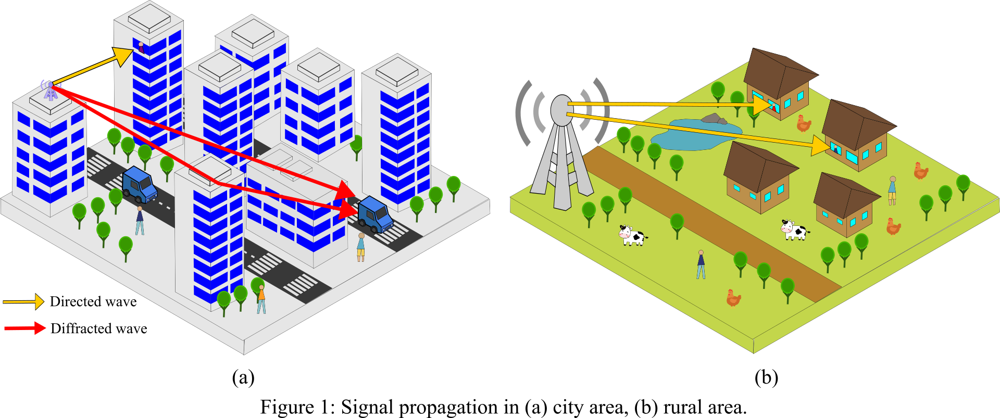

# Scattering Field Calculation by a Building with Multiple Windows using Kirchhoff Approximation (KA) Method

This repository contains the code and documentation for calculating the scattering field produced by a building with multiple windows using the Kirchhoff Approximation (KA) method.
The KA method is a well-known high-frequency technique used in electromagnetics to approximate the scattered field by large, smooth surfaces.

## Project Overview
Electromagnetic (EM) waves are fundamental to modern technologies, especially wireless communication systems, which rely on either directed or diffracted waves for information transmission.
As illustrated in Fig. 1 (a), signals can be transmitted either directly from the antenna to the device (yellow arrow) (Light of Sight-LOS) or through diffraction (red arrow).
In rural environments with minimal high-rise construction (Fig. 1 (b)), directed wave propagation often dominates.
However, in urban environments, understanding EM scattering becomes even more critical due to the abundance of tall buildings and complex structures.
Buildings can block, reflect, or diffract EM waves resulting in signal degradation, delays, or weak connections. When buildings block the LOS path, communication relies on the scattering field to transmit signals.
Buildings are the dominant scatterers determining propagation properties in urban areas. Over half of the global population currently resides in urban areas, according to the World Bank.
This number is expected to increase significantly to 6 billion by 2045, growing by a factor of 1.5.
Thus, understanding how EM waves scatter in such environments is essential for designing efficient wireless networks that ensure smooth signal coverage across urban areas and help minimize signal interference.
This will become even more important as more high-rise buildings are built in urban areas and technologies that rely on strong wireless connections, such as smart cities and the Internet of Things (IoT), become more common.
Additionally, calculating these scattering effects allows for optimizing communication designs without the need for extensive physical measurements or simulations that often require high-performance, costly computational resources.



Calculating the electromagnetic field distribution in a given area might be solved by two methods: full-wave simulators and approximation methods.
However, by using full-wave simulators (HFSS, CST), simulating high-rise buildings poses significant computational challenges.
These simulations can demand excessive memory and computation time, sometimes making them impossible to complete.
To overcome these limitations, researchers have developed approximation methods to save time and resources.
This research utilizes one such method, the Kirchhoff Approximation (KA), to compute the scattering from a single building.
This approach then allows for the efficient calculation of fields in areas with multiple buildings, enabling a practical analysis of complex urban environments.

The KA method approximates the scattering by assuming equivalent magnetic currents on virtually closed surfaces on the windows and the exterior of the building.
These currents are induced by the incident plane wave and the subsequent interaction fields within the windows.
The EM field inside the window apertures is represented in terms of rectangular waveguide modes.
This allows for the theoretical calculation of the reflection and transmission of the modal field at the window glass layers using waveguide modal theory.
When the distance between windows is significantly larger than the wavelength,
the interaction between the windows can be considered negligible.
Thus, the total scattering field of the building with multiple windows can be approximated by superposition the results obtained for each individual window.

## Features

- **Implementation of Kirchhoff Approximation (KA)**: The code implements the KA method to calculate the scattered field from the building structure.
- **Complex Building Model**: The building is modeled with multiple windows to represent realistic urban scenarios.
- **High-Frequency Analysis**: Suitable for high-frequency electromagnetic wave applications, where the KA method provides accurate approximations.
- **Visualization Tools**: Includes tools for visualizing the geometry of the building and the resulting scattering fields.

## Repository Contents

- **src/**: Contains the source code for the scattering field calculation.
- **images/**: Contains images.
- **docs/**: Documentation files, including theoretical background, usage instructions, and detailed explanations of the KA method. (Updating...)

## Prerequisites

- Python 3.x
- tkinter
- NumPy
- Matplotlib (for visualization)


## How to run
 Run ```src/GUI.py```
 
## Example Figure


The accuracy of the KA method is validated by measurement results and results collected by HFSS Physical Optics.
The frequency measurement is 5.9 GHz.


The bistatic pattern of a 7-storey building when it is illuminated by a 4G LTE (700-MHz) incident plane wave.


<p style="font-size: larger;">Due to privacy concerns, the original computation files of the program have been deleted. <strong>They will be uploaded after I complete my PhD on March 31, 2025!</strong></p>

## References

<a id="1">[1]</a> 
C.M. Bui, K. N. Nguyen and H. Shirai,
“Electromagnetic wave scatterin analysis by a window aperture on a conducting wall,"
Progress In Electromagnetics Research C, vol. 122, pp. 95–108, 2022.
<a href="https://doi.org/10.2528/PIERC22041501">DOI:10.2528/PIERC22041501</a>

<a id="2">[2]</a> 
C.M. Bui, and H. Shirai,
“High frequency plane wave scattering analysis by large buildings with multiple windows,"
IEICE Trans. Electron., vol. E108-C, no. 4, April 2025.
<a href="https://doi.org/10.1587/transele.2024REP0001">DOI:10.1587/transele.2024REP0001</a>

