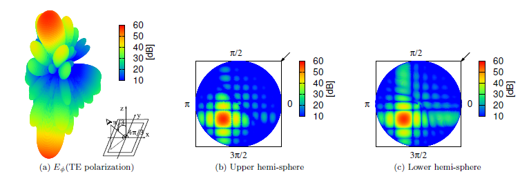

# Scattering Field Calculation by a Building with Multiple Windows using Kirchhoff Approximation (KA) Method

This repository contains the code and documentation for calculating the scattering field produced by a building with multiple windows using the Kirchhoff Approximation (KA) method.
The KA method is a well-known high-frequency technique used in electromagnetics to approximate the scattered field by large, smooth surfaces.

## Project Overview

In this project, we focus on the analysis of electromagnetic wave scattering by a complex structure such as a building with multiple windows.
The Kirchhoff Approximation (KA) method is utilized to model the scattering effects.
The KA method approximates the scattering by assuming equivalent magnetic currents on virtually closed surfaces on the windows and the exterior of the building.
These currents are induced by the incident plane wave and the subsequent interaction fields within the windows.
he electromagnetic field inside the window apertures is represented in terms of rectangular waveguide modes.
This allows for the theoretical calculation of the reflection and transmission of the modal field at the window glass layers using waveguide modal theory.
When the distance between windows is significantly larger than the wavelength,
the interaction between the windows can be considered negligible.
Thus, the total scattering field of the building with multiple windows can be approximated by superimposing the results obtained for each individual window.

## Features

- **Implementation of Kirchhoff Approximation (KA)**: The code implements the KA method to calculate the scattered field from the building structure.
- **Complex Building Model**: The building is modeled with multiple windows to represent realistic urban scenarios.
- **High-Frequency Analysis**: Suitable for high-frequency electromagnetic wave applications, where the KA method provides accurate approximations.
- **Visualization Tools**: Includes tools for visualizing the geometry of the building and the resulting scattering fields.

## Repository Contents

- **src/**: Contains the source code for the scattering field calculation.
- **examples/**: Example scripts demonstrating the usage of the code with different building and window configurations.
- **docs/**: Documentation files, including theoretical background, usage instructions, and detailed explanations of the KA method.
- **tests/**: Unit tests to ensure the correctness of the implementation.

## Prerequisites

- Python 3.x
- tkinter
- NumPy
- Matplotlib (for visualization)


## How to run
 Run ```src/GUI.py```
 
## Example Figure




<p style="font-size: larger;">Due to privacy concerns, the original computation files of the program have been deleted. <strong>They will be uploaded after I complete my PhD on March 31, 2025!</strong></p>

## References

<a id="1">[1]</a> 
C.M. Bui, K. N. Nguyen and H. Shirai,
“Electromagnetic wave scatterin analysis by a window aperture on a conducting wall,"
Progress In Electromagnetics Research C, vol. 122, pp. 95–108, 2022.
<a href="https://doi.org/10.2528/PIERC22041501">DOI:10.2528/PIERC22041501</a>
